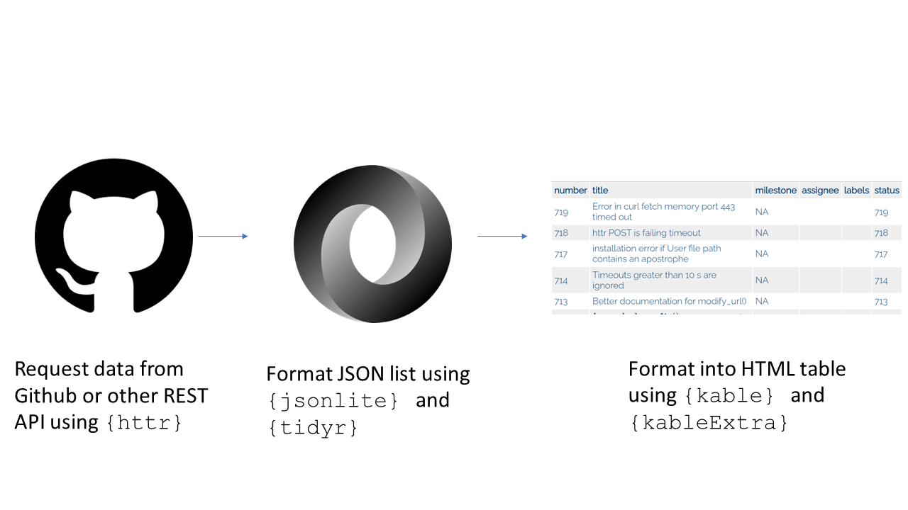
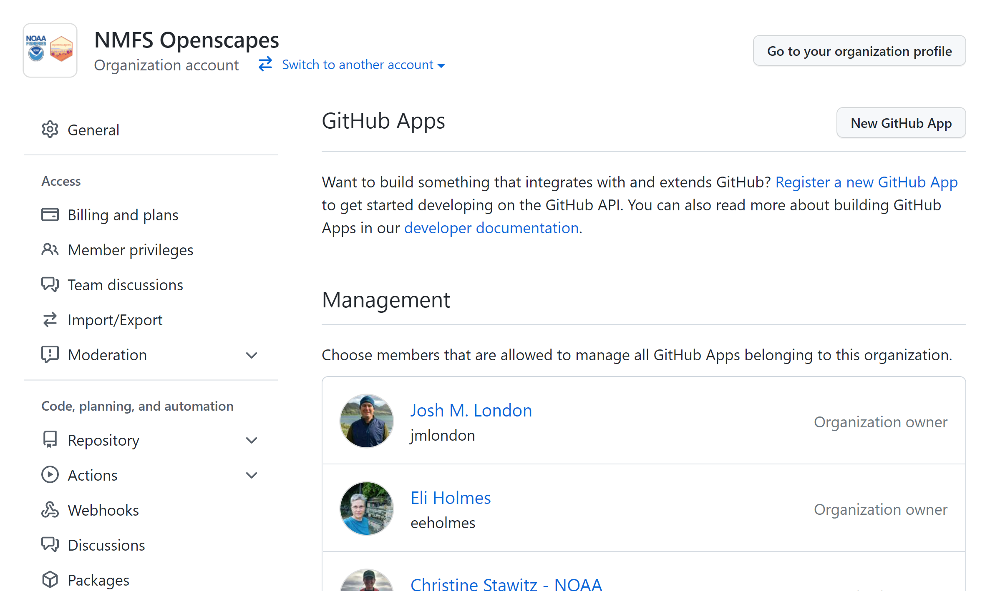

layout: true

.footnote[U.S. Department of Commerce | National Oceanic and Atmospheric Administration | National Marine Fisheries Service]

```{r setup, include=FALSE}
options(htmltools.dir.version = FALSE)
```

---

# Introduction to REST APIs

* [More info](https://restfulapi.net/)
* Conforms to the REST protocol and application which fulfils this is called RESTful
* GET, POST, PUT, DELETE
* We will focus on GET which returns data in the form of a JSON nested list.

```{r github_logo, echo = FALSE, out.width = 100}
knitr::include_graphics("assets/git.png")
```

---

## What is your experience with the REST API?


Poll: PollEv.com/christinestawitznoaafederal561
.hand-blue[
<iframe src="https://pollev-embeds.com/multiple_choice_polls/4t0K0voWl7KZQPsjrE2zV/respond" width="800px" height="600px"></iframe>
]


---

# Github
* Projects on Github return API data about repositories and/or organizations
* Inbuilt tools in `R` to access, format, and present this data
* There is also the `{gh}` package which is more minimal but may meet your needs: https://gh.r-lib.org/ 

---

class: middle

# Putting it all together

```{r flowchart, echo = FALSE}

```

---

## How it works

- getting the data (REST API using the `{httr}` package)
- filtering and grouping the data (JSON output using `{jsonlite} ` package)
- presenting the data (`{kable}` and `{kableExtra}` packages) 

---

## Getting the data

More info on Github REST API: https://docs.github.com/en/rest/overview/resources-in-the-rest-api

To get the data, you will first need to allow access to your API via Github.
Open your profile -> Settings -> Developer Settings
Under "Github Apps" make sure your profile has access

```{r gitpic, echo = FALSE}

```

---

## Creating a token
Click "Oauth apps" and follow these instructions to create a new Oauth app.
https://docs.github.com/en/developers/apps/building-oauth-apps/creating-an-oauth-app
You can use http://localhost:1410 as the port.
While filling out the form, you will see two hexadecimal codes - one is your Secret and the other is the Key. COPY THESE DOWN. You will not be able to see them again.

---
# Using `{httr}` once you get the code

https://nmfs-fish-tools.github.io/projectstats/ 

This is an example from Hadley Wickham's `{httr}` documentation so the key and secret are published on the web.

```{r showfunc, include = TRUE}
remotes::install_github("nmfs-fish-tools/projectstats")
require(projectstats)
httr_table <- get_issues(appname_ = "github",
key_ = "56b637a5baffac62cad9",
secret_ = "8e107541ae1791259e9987d544ca568633da2ebf",
repo_name = "r-lib/httr")
```

---
# Privacy

You should not publish your key & secret to Github or within shared code! 
Keep the key & secret stored locally. You can hide it in your operating system's credential store using the `{keyring}` package if needed.

```{r keyring}
require(keyring)
keyring::key_set_with_value("httr_secret", "8e107541ae1791259e9987d544ca568633da2ebf", username = "chris")
keyring::key_set_with_value("httr_key", "56b637a5baffac62cad9", username = "chris")
secret <- keyring::key_get("httr_secret", "chris")
key <- keyring::key_get("httr_key", "chris")

```

---

# Pulling relevant information out of the JSON

The JSON file you get back from Github is large and duplicative, so I wrote the 
`create_issue_table` function to extract a number of key column headers you might be interested in: `number`, `title`, `labels`, `milestone`, `pull_request`, and `assignee`. Many of these are returned as nested lists with auxiliary information, e.g. the color of the label in addition to its name. Future work on the package could include customizing how the table is returned.

---

# Creating html tables with `{kable}` and `{kableExtra}`

`{kable}` creates basic HTML tables and `{kableExtra}` allows you to format them in certain ways. 

---

# Issue table

```{r createtable}
create_issue_table(httr_table)
```

---
# Pull request table

Pull requests are stored in Github as issues, so they get returned in the JSON list and will need to be filtered in or out depending on the table. `create_pr_table` will create a similar HTML table for pull requests.

```{r createprtable}
create_pr_table(httr_table)
```
---

# Emailing :(

There is a package called `{blastula}` that enables sending emails from R but I have unfortunately not yet worked out if it is possible to authenticate. Our RStudio Connect instance can also send email but I need to format our listserv to do it.

In other words, stay tuned!

---

# Resources
*
*
*